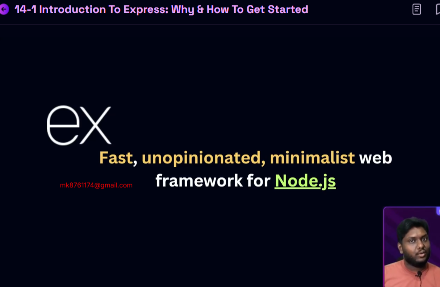
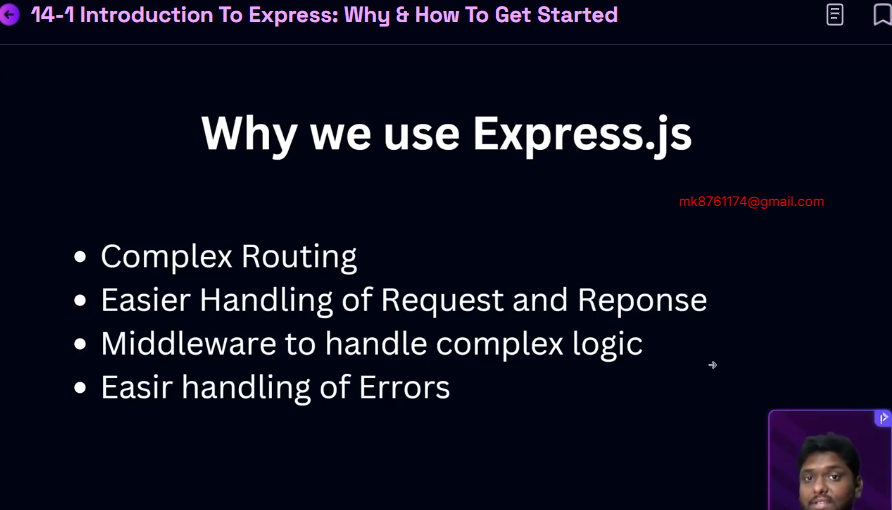
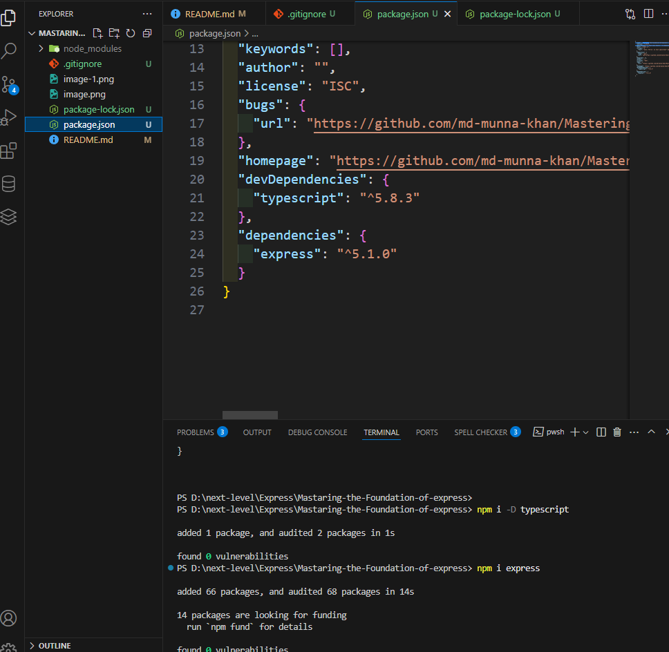
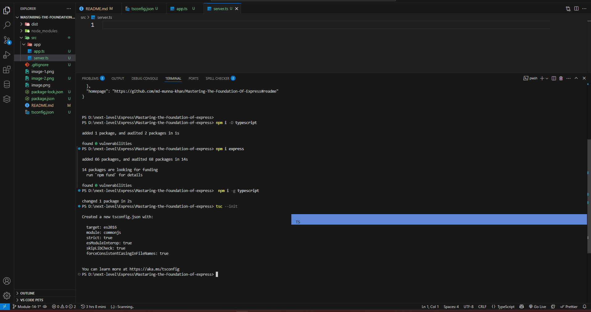
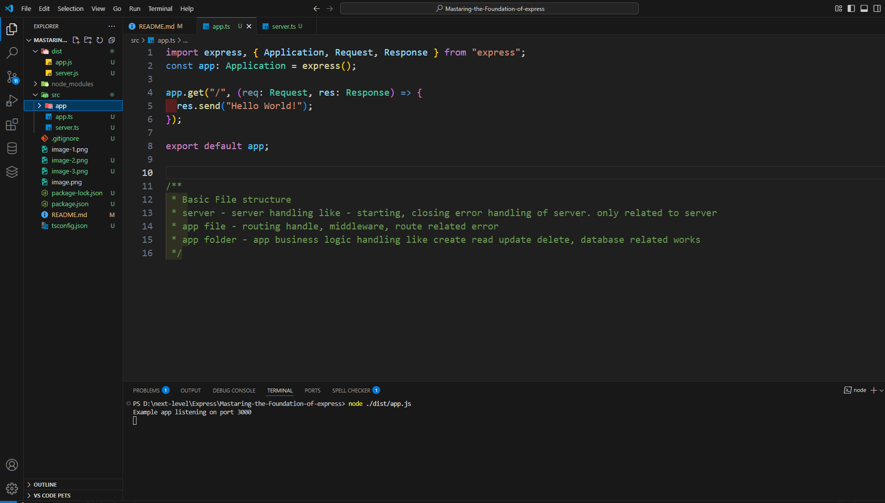

# Mastering The Foundation Of Express
##### express
- fast very fast
- 2 unopinionated  so what is opinionated?
ans opinion as like redux,nextjs there who is system he declired i mean rules and regulation you must be follow there rules and system
and unopinionated you just follow our function and you can do your own pattern and structure it as your wish no problem
- 3

## 14-2 Creating Basic Web server with Express
###### What is devDependencies?
when we are install package there are 2 types====>
- 1 dependency when our project live not need those package only need in development as like typescript
 when we are are run project in node js in of the typescript converted in javascript

 ans =devDependencies are the packages that you only need during development, not when the application is running in production.
- 2 main dependency as like express ,react etc

